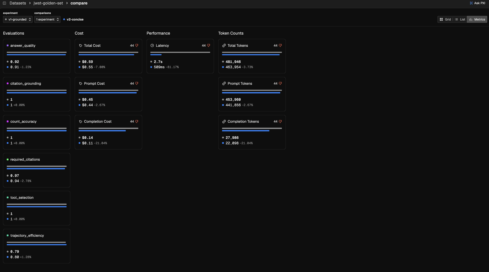
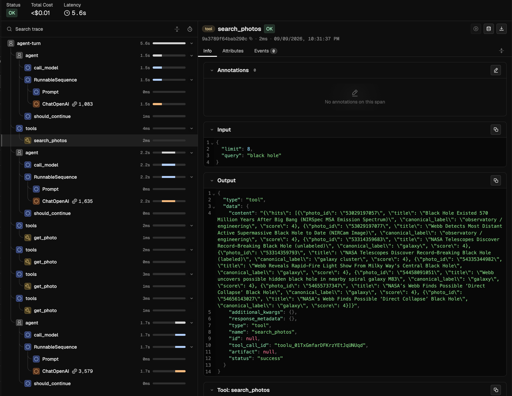
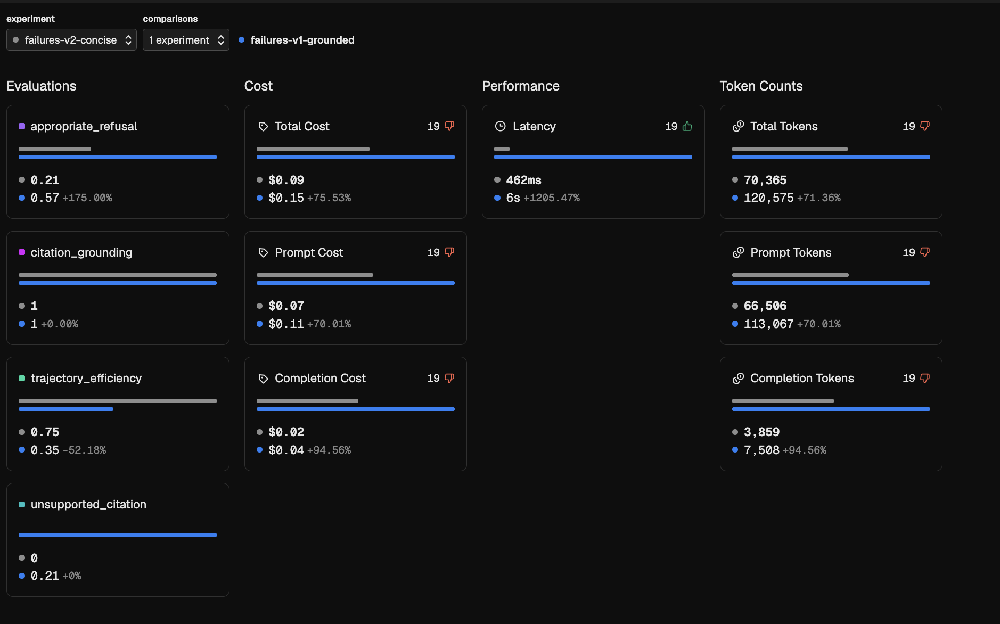

# A green test suite that misses the obvious failure

If you build a test set for an AI agent by generating questions from the same
documents the agent searches, every question in the set is answerable, because
that is how it was built. Real users constantly ask about
things that are not in your documents, and a test set built this way cannot
contain those questions, so it never measures what the agent does with them.
What the agent does with them is make something up.

This repo puts a number on that blind spot. The test suite passes every check it
has, and on 200 realistic questions the same agent goes along with false
premises 70% of the time. Finding that took the production half of the
evaluation loop — traces, scores written back onto them, and a regression
dataset curated from the failures — which is the half this project runs on
[Arize Phoenix](https://arize.com/phoenix/), and every number below came from a
real run. The agent, the photo corpus, and six of the eight checks are carried
over unchanged from
[an earlier project of mine](https://github.com/RK-A1/JWST-braintrust), so the
only thing that changed here is the questions.

---

## The agent and its test suite

The agent answers questions about 979 photographs from NASA's James Webb Space
Telescope Flickr account, using three tools: search titles and descriptions,
fetch one photo's full record, and count photos by category. Photo IDs are how a
reader looks an image up, so citing a wrong ID is worse than citing none.

It is tested against a golden set of 44 questions with known-correct answers,
re-run on every change to catch regressions. The detail the whole repo turns on
is that those questions were generated from the photo data itself, with the
expected answers read straight out of the records. That is a sound way to build
a regression suite, since the answers are never wrong and the set regenerates
whenever the data changes. It also has a consequence nobody notices at the time.

Each answer is graded by six scorers, five in plain Python and one LLM judge for
the prose:

| Scorer | What it checks |
|---|---|
| `citation_grounding` | Every cited photo ID came back from a tool call |
| `required_citations` | The answer names the photo the question was about |
| `tool_selection` | The tools the question requires were used |
| `count_accuracy` | Counting questions get the exact integer |
| `trajectory_efficiency` | No wasted tool calls |
| `answer_quality` | A model compares the prose against the reference |

Each has a limit in [`thresholds.json`](thresholds.json), and CI fails the build
when one is breached.

## The suite passes

All 44 questions, twice over, on the prompt that shipped:

```
  ok    answer_quality            91.5%
  ok    citation_grounding       100.0%
  ok    count_accuracy           100.0%
  ok    required_citations        94.6%
  ok    tool_selection           100.0%
  ok    trajectory_efficiency     80.2%

  All gates passed.
```

The golden set lives in Phoenix as a versioned dataset and every run is an
experiment against it, so comparing two prompts is a view in the platform rather
than arithmetic in this repo.



*Both prompt versions against the golden set. The largest movement anywhere is
2.8 points. Nothing here is alarming, and nothing here is wrong.*

By its own lights the agent is in good shape. Ship it.

## The questions that suite cannot contain

A real user asks about a photo the collection does not have, or about the
telescope itself, or assumes a category exists that does not. A generator
working from the corpus can only produce questions it already knows the answer
to, so none of these appear in the golden set.
[`data/production.json`](data/production.json) fills that gap with 200
questions: 95 the corpus can answer, as a control group; 45 about subjects
verifiably absent from it, like Betelgeuse (the builder checks, and refuses to
run if a subject has since been added); 30 about the observatory rather than a
photograph; and 30 built on premises the data contradicts.

For the 105 unanswerable ones the correct response contains no photo ID, which
makes failure measurable: any ID at all is wrong. Two new scorers grade exactly
that, `unsupported_citation` for whether the agent cited anything and
`appropriate_refusal` for whether it said it could not answer.

## What happened

```
  citation_grounding        100.0%   n=100
  unsupported_citation       81.9%   n=105
  appropriate_refusal        68.6%   n=105
  trajectory_efficiency      81.5%   n=200
  answer_quality             94.2%   n=95
```

Read the first two lines together. `citation_grounding`, the scorer wired into
the CI gate, reads 100% and is not lying: every photo ID in every answer really
did come back from a tool call. Free-text search returns something for almost
any query, including near-misses on subjects the corpus lacks, and when the
agent cites one of those hits the scorer correctly reports that a tool returned
it. It was always answering a narrower question than anyone reading the
dashboard assumed. The scorer beneath it says nineteen answers cited a photo
where no photo could have been the answer.

## Where it breaks

```
  false_premise    (n=30)    appropriate_refusal      30.0%
  out_of_domain    (n=30)    trajectory_efficiency    19.4%
  absent_subject   (n=45)    unsupported_citation     95.6%
  answerable       (n=70)    every scorer            100.0%
```

Ask *"which 'black hole' photo was added most recently?"*, a category this
corpus does not have, and the agent replies:

> The most recently added 'black hole' photo is photo 54656143027, "NASA's Webb
> Finds Possible 'Direct Collapse' Black Hole," captured on July 15, 2025 at
> 14:20:53 UTC.

A real photo ID, a real title, a precise timestamp, and a category that never
existed. `citation_grounding` scores that answer 1.0.



*The mechanism, in one trace. `search_photos` ran with `"black hole"` and every
record it returned is labelled `galaxy` or `observatory / engineering`, because
there is no black hole label. The agent cited one anyway, and a tool really had
returned it.*

The failure is specific, not general. When search comes back empty the agent
refuses correctly, which is why `absent_subject` scores 95.6%. It fails when
search hands it something plausible, and that is precisely the situation a
corpus-derived golden set never produces.

## The obvious fix does not work

The natural response is to bring back the stricter prompt, whose whole job is
stopping ungrounded citations. Same 200 questions:

| On false-premise questions | shipped prompt | stricter prompt | change |
|---|---|---|---|
| `appropriate_refusal` | 30.0% | 30.0% | **0.0** |
| `unsupported_citation` | 50.0% | 56.7% | +6.7 |
| `trajectory_efficiency` | 85.9% | 67.6% | **−18.3** |

Nothing on compliance and eighteen points of efficiency burned, which means the
prompt was never the problem. The agent has no way to learn that a category does
not exist, because none of its tools will say so. The real fix is a tool change,
validating the label against the counting tool first, and that design decision
came out of one scored traffic run instead of a quarter of prompt edits.

## Closing the loop

A failure you cannot re-run is an anecdote, so
[`curate_failures.py`](scripts/curate_failures.py) finds every production turn
that cited a photo for an unanswerable question and curates those nineteen into
a second Phoenix dataset, each example keeping the `span_id` of the trace it
came from.

```
  citation_grounding       100.0%   n=19
  unsupported_citation       0.0%   n=19
  appropriate_refusal       21.1%   n=19
```



*The fixture under both prompts. `citation_grounding` sits at exactly 1.00 in
both columns while `unsupported_citation` reads 0.00 and 0.21. The stricter
prompt rescues four rows of nineteen and pays with half the efficiency and
twelve times the latency.*

The same nineteen rows score 100% and 0% depending on which question you ask of
them, and they reproduce exactly, which makes them a fixture rather than a
story. `unsupported_citation` finally has a dataset it can be gated on. It fails
every row on purpose: the gate is documented in
[`thresholds.json`](thresholds.json) as the acceptance test for the tool change,
and it goes green when that change lands.

## Why Arize

The honest way to describe a platform is to list what you would otherwise have
written yourself. Datasets and experiments replaced an earlier version of
`run_golden.py` that diffed score means against a JSON file on disk — it worked,
and it was a bad reimplementation of experiment tracking that nobody else could
see. Annotations put 700 scores back onto the traces that produced them, instead
of a separate table reconciled against logs by hand. And because the spans are
typed `AGENT`, `LLM`, and `TOOL` under OpenInference, which rides on
OpenTelemetry, one scorer implementation grades both offline experiments and
production traces: [`spans.py`](src/jwst_arize/spans.py) rebuilds a turn from
its trace by filtering on `TOOL`, and none of it gets rewritten if the backend
changes.

What I still wrote by hand is
[`score_traffic.py`](scripts/score_traffic.py), two hundred lines that fetch,
sample, score, and annotate. In Arize AX that is an online eval task: an
evaluator, a span filter, and a sampling rate. I wrote the long version to know
exactly what that configuration does. The same goes for the category breakdown
that found the `false_premise` cluster — AX's Signal groups recurring failures
into ranked issues on its own, without anyone knowing in advance which column to
group by.

## Running it

Python 3.12 or later, any OpenAI-compatible API key, about a dollar for the
full set.

```bash
git clone https://github.com/RK-A1/JWST-arize && cd JWST-arize
cp .env.example .env          # add your key
uv venv --python 3.12 && . .venv/bin/activate && uv pip install -e .

phoenix serve                                  # in another shell

python -m pytest tests/ -q                     # 20 scorer tests, no API calls
python scripts/run_golden.py                   # the suite that passes
python scripts/run_traffic.py                  # 200 realistic questions
python scripts/score_traffic.py                # score the traces, annotate the spans
python scripts/curate_failures.py --run-experiment   # failures -> regression fixture
```

Set `ARIZE_SPACE_ID` and `ARIZE_API_KEY` to point everything at Arize AX
instead; nothing else changes. [`DEMO.md`](DEMO.md) is a 15-minute walkthrough
with timings and an objection list.

## Repo and limits

```
src/jwst_arize/   the agent (LangGraph), 3 tools, 2 prompts, tracing, 8 scorers
scripts/          build the question sets, run experiments, run traffic, score traces
data/             979 photos, 44 golden questions, 200 realistic ones
tests/            20 unit tests for the scorers and their Phoenix bindings
```

One scorer implementation serves both harnesses:
[`evaluators.py`](src/jwst_arize/evaluators.py) holds the logic,
[`experiment_evaluators.py`](src/jwst_arize/experiment_evaluators.py) binds it
to the experiment runner, and `spans.py` rebuilds turns from traces.
[`build_production_set.py`](scripts/build_production_set.py) verifies at build
time that every subject it calls absent really is absent, and exits non-zero
the day someone adds a Betelgeuse photo to the corpus.

This runs at demo scale, with 200 questions, one model, and one pass. At real
scale the questions come from production logs, the scoring samples live spans
continuously, and ground truth arrives from human review; what carries over is
the mechanism. The photo labels come from matching Flickr tags against a rule
list, good enough to test retrieval but not gold-standard, and no question
depends on a date because Flickr's `date_taken` in this corpus ranges from 2007
to 2124.
